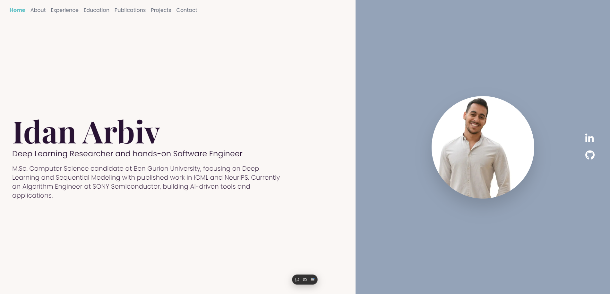

# Omer Geva's Portfolio

## Table of Contents

- [Description](#description)
- [Features](#features)
- [Technology Stack](#technology-stack)
- [Installation](#installation)
- [Environment Variables](#environment-variables)
- [Email Support](#email-support)
- [Folder Structure](#folder-structure)
- [Contact](#contact)
- [License](#license)

---

## Description

Welcome to my portfolio! This personal portfolio website showcasing my projects, skills, and professional journey.
Built with modern web technologies, this website features a clean, responsive design and a modular architecture for easy maintenance and scalability.

---

## Features

- **Modern & Responsive Design** – Adapts seamlessly to mobile, tablet, and desktop
- **Modular Architecture** – Built with React and Next.js using reusable components
- **Tech-Driven** – Includes TypeScript, Framer Motion, TailwindCSS
- **Contact Form** – Sends real emails via Nodemailer and Gmail SMTP
- **Easy Customization** – Clean code structure for quick updates

---

## Technology  Stack

- **Framework**: Next.js
- **Styling**: Tailwind CSS
- **Animations**: Framer Motion
- **Deployment**: Vercel

---

## Installation

To get started, just clone the repository and run `npm install && npm run dev`:

git clone https://github.com/omergev/Omer-Geva-Portfolio

npm install

npm run dev

Open your browser and navigate to http://localhost:3000 to view the website.

---

## Environment Variables

To use the contact form (email feature), you need to configure environment variables.
Create a file named .env.local in the project root with the following content:

EMAIL_USER=your_email@gmail.com
EMAIL_PASS=your_app_password
EMAIL_HOST=smtp.gmail.com
EMAIL_PORT=587

---

## Contact

For any questions or suggestions, feel free to reach out:

- **Name**: Omer Geva
- **Email**: omergeva2022@gmail.com
- **LinkedIn**: linkedin.com/in/omergeva
- **GitHub**: github.com/omergev
